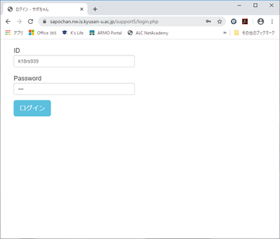
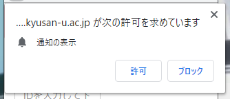
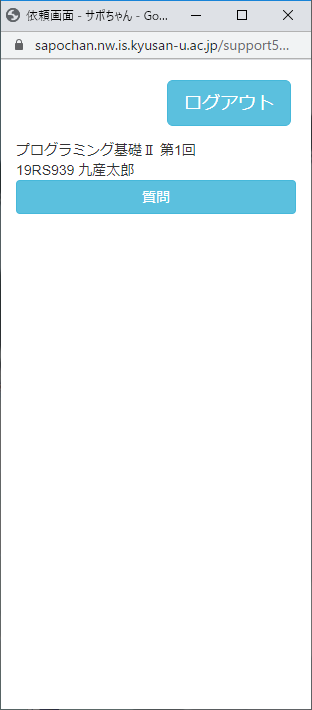
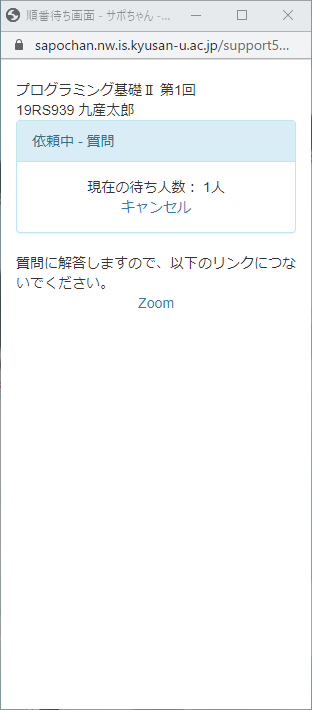

# サポちゃん

サポちゃんとは、下川研で開発している演習系講義支援システムです。今回は、遠隔講義の支援用に本システムを使います。
また、サポちゃんにログインすることで、講義に出席したと判定します。
講義時間が始まったら、サポちゃんにログインするのを忘れないようにしてください。
質問の有無に関わらず、全員、かならず講義時間中にログインしてください。

## ログイン方法

1. [サポちゃんログインページ](https://sapochan.nw.is.kyusan-u.ac.jp/support5/) にアクセスします。
2. 以下のようなログインページが表示されます。ID と Password は K'sLife と同じものです。
    
3. 初回ログイン時は、以下のように許可を求めてきます。許可してください。
    
4. 以下のような小さなウィンドウが表示されたらログイン成功です。
    
5. 質問があるときには、このウィンドウの「質問」ボタンを押してください。他の受講生には知られること無く質問の意思を、教員に伝えることが出来ます。
6. 質問ボタンを押すと、以下のような表示に変わります。この画面では、この時点で、質問回答を待っている学生が1名、すなわちじぶんだけであることが分かります。
    
7. Zoom というリンクをクリックして Zoom ミーティングに接続して待機しておいてください。
8. 接続先の Zoom は、授業全体の Zoom ミーティングです。他の学生が参加済みかもしれませんが、心配しないでください。先生側から個別のビデオ通信を開始して質問に対応します。
